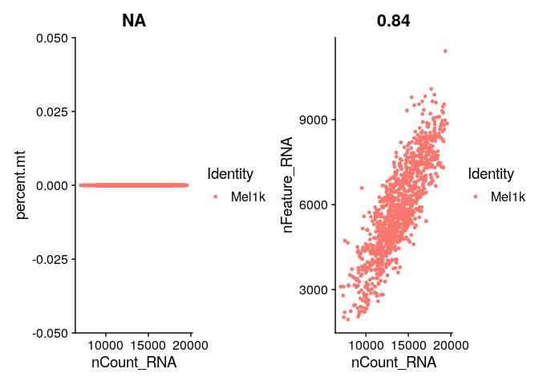

R Markdown
----------

This is an R Markdown document. Markdown is a simple formatting syntax
for authoring HTML, PDF, and MS Word documents. For more details on
using R Markdown see
<a href="http://rmarkdown.rstudio.com" class="uri">http://rmarkdown.rstudio.com</a>.

When you click the **Knit** button a document will be generated that
includes both content as well as the output of any embedded R code
chunks within the document. You can embed an R code chunk like this:

    # Initialize the Seurat object with the raw (non-normalized data).

    library(dplyr)

    ## 
    ## Attaching package: 'dplyr'

    ## The following objects are masked from 'package:stats':
    ## 
    ##     filter, lag

    ## The following objects are masked from 'package:base':
    ## 
    ##     intersect, setdiff, setequal, union

    library(Seurat)

    ## Attaching SeuratObject

    library(patchwork)
    library(data.table)

    ## 
    ## Attaching package: 'data.table'

    ## The following objects are masked from 'package:dplyr':
    ## 
    ##     between, first, last

    Sys.sleep(2)

    # Load the scdata dataset
    df.data <- read.table("scrdatafile.txt")
    Sys.sleep(2)
    #transpose data frame
    df.data <- transpose(df.data)
    Sys.sleep(2)

    # data preparation 
    #========================
    rownames(df.data) <- df.data$V1

    df.data <- df.data[,-1]

    colnames(df.data) <- df.data[1,]

    df.data <- df.data[-1,]

    orgdata.data <- df.data
    #========================
    # unique(df.data$tumor)

    # select malignant data object and remove non-malignant and unresolved
    mal.data <- df.data[(which(df.data$`malignant(1=no,2=yes,0=unresolved)` == 2 )),]

    mal.data <- mal.data[(which(mal.data$tumor == "81" | mal.data$tumor == "78" | mal.data$tumor == "79" | mal.data$tumor == "88" | mal.data$tumor == "80" | mal.data$tumor == "89" )),]

    # unique(mal.data$tumor)

    # table(mal.data$tumor)

    # which(is.na(colnames(mal.data)))

    # drop 3 metadata columns

    mal.data <- mal.data[,-1]
    mal.data <- mal.data[,-1]
    mal.data <- mal.data[,-1]

    # Initialize the Seurat object with the raw (non-normalized data).
    pbmc <- CreateSeuratObject(counts =  t(mal.data), project = "Mel1k", min.cells = 3, min.features = 10)

    ## Warning: Feature names cannot have underscores ('_'), replacing with dashes
    ## ('-')

    pbmc

    ## An object of class Seurat 
    ## 19950 features across 1061 samples within 1 assay 
    ## Active assay: RNA (19950 features, 0 variable features)

Explore the object and get the first five rows
----------------------------------------------

    ##                              orig.ident nCount_RNA nFeature_RNA percent.mt
    ## Cy81_FNA_CD45_B01_S301_comb       Mel1k   16763.33         6386          0
    ## Cy80_II_CD45_B07_S883_comb        Mel1k   16326.73         5913          0
    ## Cy81_Bulk_CD45_B10_S118_comb      Mel1k   17698.97         8360          0
    ## Cy80_II_CD45_C09_S897_comb        Mel1k   14870.72         6019          0
    ## Cy81_FNA_CD45_E05_S341_comb       Mel1k   18051.43         7718          0

    # Visualize QC metrics as a violin plot
    VlnPlot(pbmc, features = c("nFeature_RNA"))

    # FeatureScatter is typically used to visualize feature-feature relationships, but can be used
    # for anything calculated by the object, i.e. columns in object metadata, PC scores etc.

    plot1 <- FeatureScatter(pbmc, feature1 = "nCount_RNA", feature2 = "percent.mt")

    ## Warning in cor(x = data[, 1], y = data[, 2]): the standard deviation is zero

    plot2 <- FeatureScatter(pbmc, feature1 = "nCount_RNA", feature2 = "nFeature_RNA")
    plot1 + plot2

    pbmc <- subset(pbmc, subset = nFeature_RNA > 200 & nFeature_RNA < 12000 & percent.mt < 5)

    pbmc <- NormalizeData(pbmc, normalization.method = "LogNormalize", scale.factor = 10000)

    pbmc <- FindVariableFeatures(pbmc, selection.method = "vst", nfeatures = 2000)

    # Identify the 10 most highly variable genes
    top10 <- head(VariableFeatures(pbmc), 10)

    # plot variable features with and without labels
    plot1 <- VariableFeaturePlot(pbmc)
    plot2 <- LabelPoints(plot = plot1, points = top10, repel = TRUE)

    ## When using repel, set xnudge and ynudge to 0 for optimal results

    plot1 + plot2

    all.genes <- rownames(pbmc)
    pbmc <- ScaleData(pbmc, features = all.genes)

    ## Centering and scaling data matrix

    pbmc <- RunPCA(pbmc, features = VariableFeatures(object = pbmc))

    ## PC_ 1 
    ## Positive:  TYR, HLA-B, PMEL, HLA-C, MLANA, CAPN3, STMN1, LGALS3, HLA-A, NSG1 
    ##     CTSD, MCAM, RPS4Y1, APOC2, MBP, HLA-F, IFI27, APOE, SERPINA1, GPNMB 
    ##     TRIML2, B2M, APOD, MTRNR2L2, ABCB5, RDH5, LYRM9, IFI6, CTSB, TNFSF4 
    ## Negative:  COL1A2, SAA1, SFRP1, MGP, HAPLN1, ABCA8, MAGEA4, TERT, IFITM1, TF 
    ##     C2orf82, C1QTNF3, FMOD, TFAP2C, ALDH1A3, PDLIM4, MAGEC2, CP, NGEF, VAMP5 
    ##     RGS5, ITGB4, COL3A1, TNFRSF11B, CYP4X1, APP, AKR1C3, DHRS3, DKK3, REM1 
    ## PC_ 2 
    ## Positive:  DCT, PYCARD, LHFPL3-AS1, TUBB4A, RCN3, ACP5, SNAI2, SCD, KIT, TRPM1 
    ##     HSPA2, RAP1GAP, PRSS21, RGS1, CA14, TSTD1, BCAN, ADAMTS2, SCIN, TYRP1 
    ##     UQCRFS1, PKMYT1, SLC38A8, BCL2A1, DTL, CDCA7, BUB1, TK1, CTSK, GALNT18 
    ## Negative:  A2M, TM4SF1, SERPINA3, ANXA1, SERPINE2, SLC26A2, CTSB, KRT18, MIA, S100A6 
    ##     TIMP1, MT2A, CST3, HSPA1A, TSC22D3, PRDX1, SPON2, DUSP6, PLEKHB1, CFI 
    ##     ERRFI1, EGR1, SPP1, S100A16, CRYAB, CLU, GBP2, B2M, PDK4, HSPA1B 
    ## PC_ 3 
    ## Positive:  FAM3B, BMX, CDCP1, GJC3, TNC, MMP8, MATN2, RNASE1, CNIH3, MT1L 
    ##     KRBOX1, RAMP3, SLC13A3, LOC387895, GFRA3, SEMA3B, IGFBP7, NSG1, RXRG, ANXA1 
    ##     MT1A, S100A4, CASP1, SERPINA3, CAPG, SKAP1, FCRLA, ELOVL2, APOBEC3B, APOC2 
    ## Negative:  SERPINF1, BCAN, DCT, TRPM1, CA14, SCIN, ZBED3-AS1, KRTAP19-1, TMC6, CDKN2A 
    ##     GAS5, PTP4A3, LMCD1, QPCT, CNRIP1, RPL18A, TUBB4A, C17orf76-AS1, FDXR, EGFL8 
    ##     B2M, RPL21, CCDC74A, SNORD76, ADAMTS2, OCA2, HSPA2, SLC7A4, SNORD47, FGF13 
    ## PC_ 4 
    ## Positive:  TDRD3, ENTHD1, CNRIP1, MT1L, CDKN2A, FAM3B, CDCP1, BCHE, ADAMTS1, CSRP2 
    ##     BMX, SNORD47, GJC3, RAMP3, SKAP1, RNASE1, SERPINE2, MCHR1, SPRY1, ELOVL2 
    ##     NUPR1, MAGEC2, CNIH3, POSTN, APP, BANCR, MMP8, BAAT, IFITM2, CASP1 
    ## Negative:  PRSS21, PAEP, CRIP1, TSTD1, ADAMTS2, MGST1, SLC38A8, MAGEA3, PTGDS, HTRA3 
    ##     CDK1, GZMM, NUF2, OCA2, KIT, CDCA8, TOP2A, RPS4Y1, PKMYT1, TPX2 
    ##     GALNT18, RAB20, FXYD6, ASF1B, NUSAP1, BUB1, CDKN3, APOC1, PRC1, ANLN 
    ## PC_ 5 
    ## Positive:  ITGB2, HCLS1, CXCR4, CD37, IL2RG, CD53, ALOX5AP, GIMAP7, CORO1A, CD69 
    ##     CD3D, GIMAP4, HLA-DQA1, CD2, GIMAP5, LCP1, LAPTM5, ITM2A, LY9, HCST 
    ##     ZAP70, SAMSN1, HLA-DQA2, ARHGDIB, PTPRCAP, LCK, FCGR3A, CD48, LSP1, ADAM28 
    ## Negative:  PLK2, SLC24A5, S100B, NDUFA13, IMPDH2, SERPINE2, CTSK, RCAN1, C19orf10, GPM6B 
    ##     KLHDC8B, EIF3G, LGALS3, CRYAB, ZFYVE21, CYC1, RAB38, GSTA4, LDHA, TUBA1A 
    ##     GPNMB, PSMB6, TIMP1, DDIT3, ACP5, HPGD, GDF15, TUBB3, IDI2-AS1, DFNA5

    # Perform t-SNE and UMAP on the normalized data

    pbmc <- RunTSNE(pbmc , dims = 1:15)
    pbmc <- RunUMAP(pbmc, dims = 1:15)

    ## Warning: The default method for RunUMAP has changed from calling Python UMAP via reticulate to the R-native UWOT using the cosine metric
    ## To use Python UMAP via reticulate, set umap.method to 'umap-learn' and metric to 'correlation'
    ## This message will be shown once per session

    ## 15:39:42 UMAP embedding parameters a = 0.9922 b = 1.112

    ## 15:39:42 Read 1061 rows and found 15 numeric columns

    ## 15:39:42 Using Annoy for neighbor search, n_neighbors = 30

    ## 15:39:42 Building Annoy index with metric = cosine, n_trees = 50

    ## 0%   10   20   30   40   50   60   70   80   90   100%

    ## [----|----|----|----|----|----|----|----|----|----|

    ## **************************************************|
    ## 15:39:43 Writing NN index file to temp file /tmp/Rtmp818o8j/file27f02c5dead6
    ## 15:39:43 Searching Annoy index using 1 thread, search_k = 3000
    ## 15:39:43 Annoy recall = 100%
    ## 15:39:43 Commencing smooth kNN distance calibration using 1 thread with target n_neighbors = 30
    ## 15:39:45 Initializing from normalized Laplacian + noise (using irlba)
    ## 15:39:45 Commencing optimization for 500 epochs, with 41068 positive edges
    ## 15:39:46 Optimization finished

    # Cluster the data
    pbmc <- FindNeighbors(pbmc, dims = 1:15)

    ## Computing nearest neighbor graph

    ## Computing SNN

    pbmc <- FindClusters(pbmc, resolution = 0.1)

    ## Modularity Optimizer version 1.3.0 by Ludo Waltman and Nees Jan van Eck
    ## 
    ## Number of nodes: 1061
    ## Number of edges: 34160
    ## 
    ## Running Louvain algorithm...
    ## Maximum modularity in 10 random starts: 0.9751
    ## Number of communities: 6
    ## Elapsed time: 0 seconds

    # Plot the t-SNE & UMAP results colored by cluster
    p1 <- DimPlot(pbmc, reduction = "umap" , group.by = "seurat_clusters")
    p2 <- DimPlot(pbmc, reduction = "tsne" , group.by = "seurat_clusters")

    p1 + p2

    # Examine and visualize PCA results a few different ways
    print(pbmc[["pca"]], dims = 1:5, nfeatures = 5)

    ## PC_ 1 
    ## Positive:  TYR, HLA-B, PMEL, HLA-C, MLANA 
    ## Negative:  COL1A2, SAA1, SFRP1, MGP, HAPLN1 
    ## PC_ 2 
    ## Positive:  DCT, PYCARD, LHFPL3-AS1, TUBB4A, RCN3 
    ## Negative:  A2M, TM4SF1, SERPINA3, ANXA1, SERPINE2 
    ## PC_ 3 
    ## Positive:  FAM3B, BMX, CDCP1, GJC3, TNC 
    ## Negative:  SERPINF1, BCAN, DCT, TRPM1, CA14 
    ## PC_ 4 
    ## Positive:  TDRD3, ENTHD1, CNRIP1, MT1L, CDKN2A 
    ## Negative:  PRSS21, PAEP, CRIP1, TSTD1, ADAMTS2 
    ## PC_ 5 
    ## Positive:  ITGB2, HCLS1, CXCR4, CD37, IL2RG 
    ## Negative:  PLK2, SLC24A5, S100B, NDUFA13, IMPDH2

    VizDimLoadings(pbmc, dims = 1:2, reduction = "pca")

    DimPlot(pbmc, reduction = "pca")

    DimHeatmap(pbmc, dims = 1, cells = 500, balanced = TRUE)

    DimHeatmap(pbmc, dims = 1:15, cells = 500, balanced = TRUE)

    # NOTE: This process can take a long time for big datasets, comment out for expediency. More
    # approximate techniques such as those implemented in ElbowPlot() can be used to reduce
    # computation time
    pbmc <- JackStraw(pbmc, num.replicate = 100)
    pbmc <- ScoreJackStraw(pbmc, dims = 1:20)

    JackStrawPlot(pbmc, dims = 1:15)

    ## Warning: Removed 21742 rows containing missing values (geom_point).

    ElbowPlot(pbmc)

    # Look at cluster IDs of the first 5 cells
    head(Idents(pbmc), 5)

    ##  Cy81_FNA_CD45_B01_S301_comb   Cy80_II_CD45_B07_S883_comb 
    ##                            1                            2 
    ## Cy81_Bulk_CD45_B10_S118_comb   Cy80_II_CD45_C09_S897_comb 
    ##                            1                            2 
    ##  Cy81_FNA_CD45_E05_S341_comb 
    ##                            1 
    ## Levels: 0 1 2 3 4 5

    sum(table(Idents(pbmc)))

    ## [1] 1061

    # find markers for every cluster compared to all remaining cells, report only the positive
    # ones
    pbmc.markers <- FindAllMarkers(pbmc, only.pos = TRUE, min.pct = 0.25, logfc.threshold = 0.25)

    ## Calculating cluster 0

    ## For a more efficient implementation of the Wilcoxon Rank Sum Test,
    ## (default method for FindMarkers) please install the limma package
    ## --------------------------------------------
    ## install.packages('BiocManager')
    ## BiocManager::install('limma')
    ## --------------------------------------------
    ## After installation of limma, Seurat will automatically use the more 
    ## efficient implementation (no further action necessary).
    ## This message will be shown once per session

    ## Calculating cluster 1

    ## Calculating cluster 2

    ## Calculating cluster 3

    ## Calculating cluster 4

    ## Calculating cluster 5

    allmarkers <- pbmc.markers %>%
      group_by(cluster) %>%
      slice_max(n = 5, order_by = avg_log2FC)
